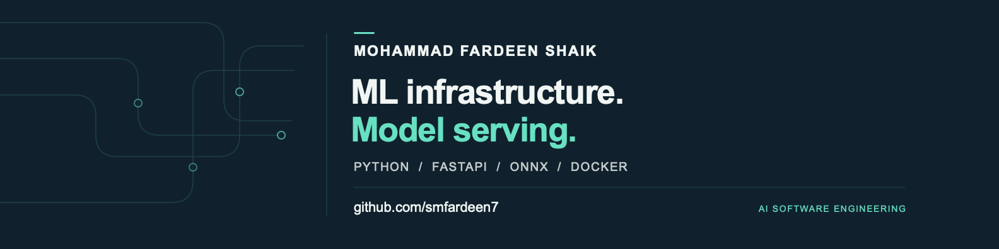
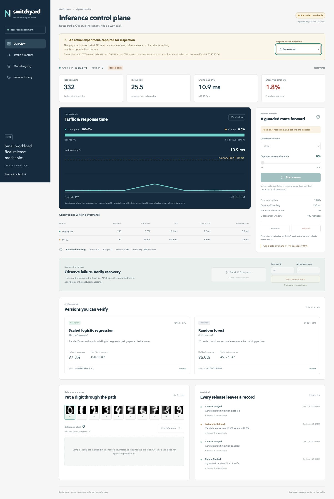

# Mohammad Fardeen Shaik

M.S. Computer Science student at George Mason University, expected May 2027, with a B.Tech. in Computer Science and Engineering from VIT. I build AI software with a focus on ML infrastructure, model serving, and the engineering work that makes model behavior measurable.

My experience includes a summer 2026 cloud/AI internship at Quadrant Technologies and earlier full-stack development at Ethnus Codemithra. At GMU, I serve as an ITS AI Ambassador and Secretary of the CS Graduate Student Association.

[LinkedIn](https://www.linkedin.com/in/shaikmofardeen/) · [GitHub projects](https://github.com/smfardeen7?tab=repositories) · [Recorded serving console](https://smfardeen7.github.io/switchyard-ml/)

## Featured: Switchyard ML

[Code](https://github.com/smfardeen7/switchyard-ml) · [Recorded console](https://smfardeen7.github.io/switchyard-ml/) · [Performance study](https://github.com/smfardeen7/switchyard-ml/blob/main/docs/PERFORMANCE.md)

A model-serving reference platform with real ONNX CPU inference, bounded dynamic batching, request deadlines, canary routing, observed error/latency guardrails, and automatic rollback. FastAPI serves the API; a React/TypeScript console exposes model lineage, metrics, and release history.

*Actual console capture from the local HTTP failure experiment. This public frame is recorded and read-only.*

- 6,144 successful requests in the recorded engine benchmark, with warmup, concurrency, hardware, and latency distributions disclosed.
- A separate HTTP experiment triggered automatic rollback and verified 160/160 successful recovery requests.
- The public console replays the captured experiment. Live inference and release controls run locally.
- Scope: one API process and CPU reference models. GPU performance, distributed serving, and production customer traffic are not claimed.

## Other projects

| Project | What to inspect |
|---|---|
| [Invoice intelligence](https://github.com/smfardeen7/ai-contract-invoice-intelligence) | Text/PDF field extraction, exact-decimal contract checks, duplicate handling, and an auditable review queue using invented examples. |
| [Shelfwise retail recommendations](https://github.com/smfardeen7/retail-recommendation-platform) | FastAPI/React analytics, SVD recommendations, RFM/KMeans segments, Apriori rules, and a time-based synthetic holdout against popularity. |
| [Audio classification lab](https://github.com/smfardeen7/infant-cry-analysis) | WAV validation, signal features, group-disjoint evaluation, and a Flask workspace; included training data is synthetic audio, not infant recordings. |
| [Autism screening research](https://github.com/smfardeen7/autism-screening-research) | Synthetic behavioral-data experiments, subject-disjoint evaluation, encrypted records, and an authenticated Flask API. No diagnostic or clinical-performance claims. |
| [Parkinson's hybrid prediction research](https://github.com/smfardeen7/parkinsons-hybrid-prediction) | Subject-disjoint Random Forest/SVM comparisons, probability calibration, and an attributed UCI evaluation with baseline results. |
| [Loan default modeling](https://github.com/smfardeen7/cooperative-bank-loan-default) | Existing synthetic-data project with PyTorch, preprocessing, training, prediction, explanation, and test modules. |

Switchyard was built in September 2026. The five invoice, retail, audio, autism, and Parkinson's repositories are original September 22–24, 2026 implementations of earlier project concepts; they are not recovered historical source. The loan project predates this portfolio refresh. Each repository states its own data, evaluation, and deployment limits.

## Additional engineering projects

| Project | What to inspect |
|---|---|
| [Sagacious-AI](https://github.com/smfardeen7/Sagacious-AI) | Parallel model-provider orchestration, streamed progress, SQLite persistence, and file-hash-bound approval for scoped changes on a new git branch. The no-key demo is deterministic; judge scores do not establish correctness. |
| [GenAI traffic fingerprinting](https://github.com/smfardeen7/fingerprint-GENAI) | PCAP/PCAPNG feature extraction, grouped dataset checks, observation-window experiments, exported models, and an offline report. The published demonstration uses synthetic sessions. |
| [My J.A.R.V.I.S](https://github.com/smfardeen7/My-J.A.R.V.I.S) | Native macOS assistant with local Ollama, speech input/output, explicit Mac commands, and Touch ID confirmation. The browser demo simulates the interface; voice matching is a fallible filter. |
| [Container delivery pipeline](https://github.com/smfardeen7/SWE645-HW2) | Docker/Tomcat packaging, Jenkins delivery configuration, and Kubernetes deployment/service manifests. No automated test stage or currently running AWS/Rancher cluster is claimed. |
| [Aleesa commerce](https://github.com/smfardeen7/aleesa) | Next.js/Prisma application with transactional stock reservations, idempotent orders, owner workflows, and a Razorpay integration. Local demonstration catalogue; merchant sandbox verification is not claimed. |

## Technical focus

Python · FastAPI · ONNX Runtime · scikit-learn · PyTorch · React/TypeScript · SQL · automated testing · CI/CD · Prometheus

My broader full-stack background includes MERN, Angular, and Spring Boot; my current focus is inference services and ML platform tools.

I'm interested in AI software engineering work on inference services and ML platform tools.
